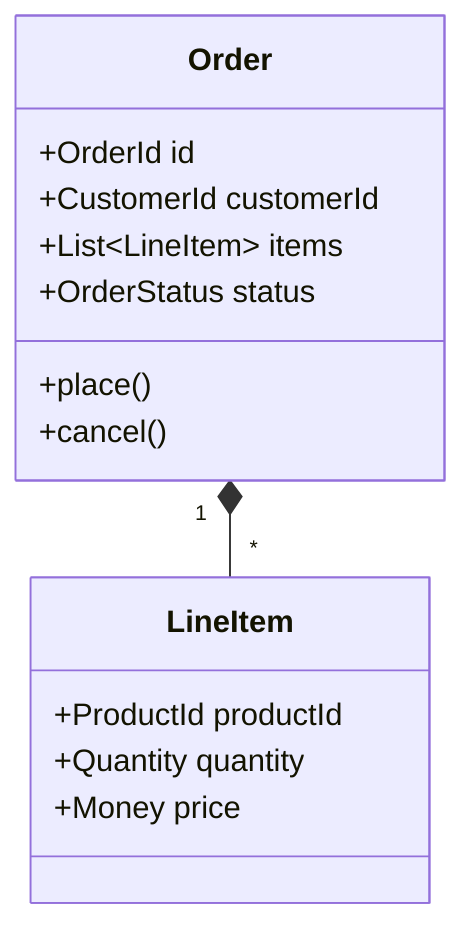
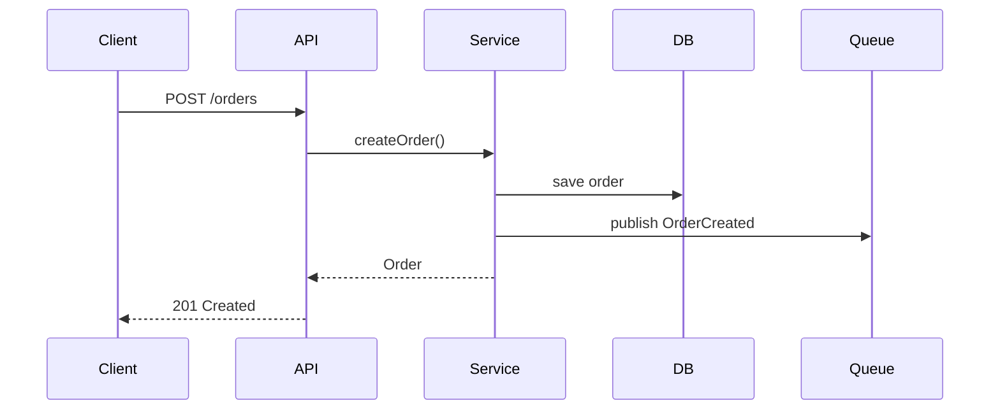

# Component Design

Deep-dive into a specific component within a larger system. **Generate diagrams** to clarify structure and interactions.

## DDD Tactical Patterns to Consider

### Aggregate Design
- What is the consistency boundary?
- What invariants must be protected?
- What is the aggregate root?
- How large should the aggregate be? (Prefer smaller, load by ID)

### Domain Events
- What state transitions are significant to other bounded contexts?
- Event naming: past tense, business language
- Event schema evolution strategy (backwards compatible)

### Repository Pattern
- Persistence ignorance in domain layer
- Query capabilities vs pure aggregate retrieval
- Specification pattern for complex queries

### Domain Services
- Stateless operations that don't belong to a single entity
- Cross-aggregate operations
- External service coordination

## API-First Design

### Synchronous APIs
- OpenAPI 3.x specification
- Versioning strategy (URL path, header, content negotiation)
- Error response standards (RFC 7807 Problem Details)
- Pagination patterns (cursor vs offset)

### Asynchronous APIs
- AsyncAPI specification for events
- Event schema registry
- Schema evolution and compatibility

### Contract Testing
- Consumer-driven contracts (Pact, Spring Cloud Contract)
- Provider verification
- Breaking change detection

## Integration Patterns

When this component talks to others:

### Synchronous
- **Request-Response**: Simple, but creates temporal coupling
- **API Gateway**: Cross-cutting concerns, routing, transformation
- **Service Mesh**: Observability, security, traffic management at infra level
- **Backend for Frontend (BFF)**: Client-specific aggregation

### Asynchronous
- **Event-Carried State Transfer**: Eventual consistency, reduced chattiness
- **Event Notification**: Light events, receiver queries for details
- **Event Sourcing**: Full audit, temporal queries, replay capability
- **CQRS**: Separate read/write models when query patterns diverge significantly

### Anti-Corruption Layer
- When integrating with legacy or external systems
- Translation between models
- Protecting your domain model from external pollution

## Resilience Patterns

- **Circuit Breaker**: Fail fast, give downstream time to recover
- **Bulkhead**: Isolate failures, prevent cascade
- **Retry with backoff**: Transient failure handling (exponential + jitter)
- **Timeout**: Bound waiting time
- **Fallback**: Graceful degradation
- **Rate Limiting**: Protect from overload

## Diagram Generation

**Generate diagrams to clarify the component design:**

### C4 Component Diagram
When detailing internal structure:
```plantuml
@startuml
!include https://raw.githubusercontent.com/plantuml-stdlib/C4-PlantUML/master/C4_Component.puml

title Component Diagram: [Component Name]

Container_Boundary(comp, "Component") {
    Component(handler, "Handlers", "Go", "HTTP/gRPC endpoints")
    Component(service, "Services", "Go", "Business logic")
    Component(domain, "Domain", "Go", "Aggregates, entities")
    Component(repo, "Repository", "Go", "Data access")
}

ContainerDb(db, "Database", "PostgreSQL")
Container(queue, "Message Queue", "Kafka")

Rel(handler, service, "Uses")
Rel(service, domain, "Uses")
Rel(service, repo, "Uses")
Rel(repo, db, "Queries")
Rel(service, queue, "Publishes")

@enduml
```

### Domain Model Diagram
When clarifying entities and relationships:


### Sequence Diagram
For complex flows within or across components:


## Questions to Explore

1. What bounded context does this belong to?
2. What are the aggregate boundaries?
3. How does this component learn about changes in other contexts?
4. What happens when dependencies are unavailable?
5. How is this component tested in isolation?
6. What are the data consistency requirements?
7. How will this component evolve independently?
8. What are the cost implications of the data storage choices?

## Output Structure

```
## Component: [name]
### Bounded Context: [context]

### C4 Component Diagram
[PlantUML diagram showing internal structure]

### Responsibility
Single sentence: what business capability does this provide?

### Aggregate Design
- Root: [entity]
- Invariants protected: [list]
- Consistency boundary: [description]

### Domain Model
[Class diagram or description of entities, value objects, relationships]

### Domain Events Published
| Event | Trigger | Schema | Consumers |
|-------|---------|--------|-----------|

### API Contract
- Sync: [OpenAPI reference or key endpoints]
- Async: [AsyncAPI reference or key events]
- Versioning: [strategy]

### Integration Points
| Dependency | Pattern | Failure Mode | Fallback |
|------------|---------|--------------|----------|

### Sequence Diagrams
[For key flows through the component]

### Data Ownership
[What data this component is the source of truth for]

### Observability
- Key metrics: [list with units]
- Traces: [span boundaries]
- Alerts: [SLO-based thresholds]

### Cost Considerations
- Storage: [choices and implications]
- Compute: [scaling strategy]
- Data transfer: [optimization opportunities]

### Testing Strategy
- Unit: [aggregate invariants]
- Integration: [adapter tests]
- Contract: [consumer-driven contracts]
- Load: [capacity requirements]
```
