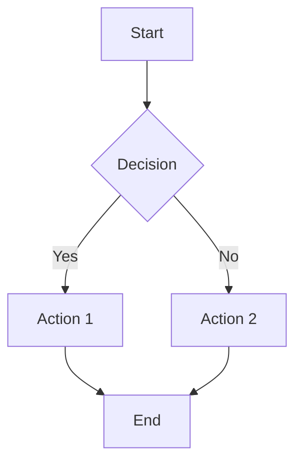
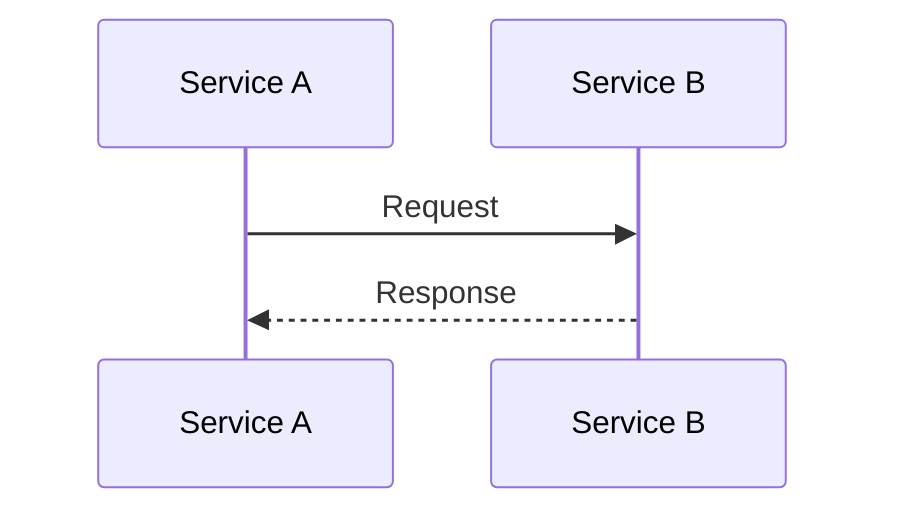
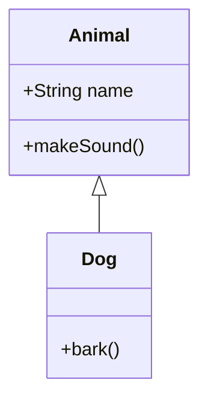
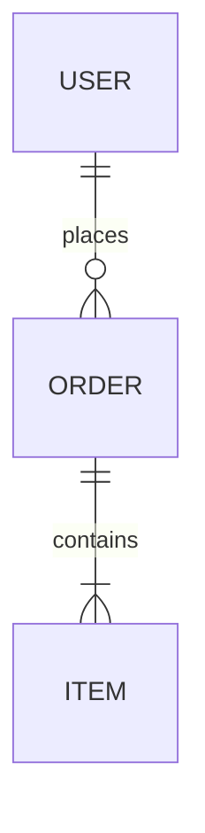

# Diagram Syntax Quick Reference

## Mermaid

### Flowchart


### Sequence


### Class


### ER


## PlantUML C4

```plantuml
@startuml
!include C4_Container.puml
Person(user, "User")
Container(app, "App", "Tech", "Desc")
Rel(user, app, "Uses")
@enduml
```

## D2

```d2
server: Web Server
db: Database
server -> db: queries
```

## Shape Reference

| Mermaid | Meaning |
|---------|---------|
| [text] | Rectangle |
| (text) | Rounded |
| {text} | Diamond |
| ([text]) | Stadium |
| [[text]] | Subroutine |
| [(text)] | Cylinder |

## Arrow Reference

| Mermaid | PlantUML | Meaning |
|---------|----------|---------|
| --> | -> | Solid line |
| -.-> | ..> | Dashed line |
| -->> | ->> | Async/return |
